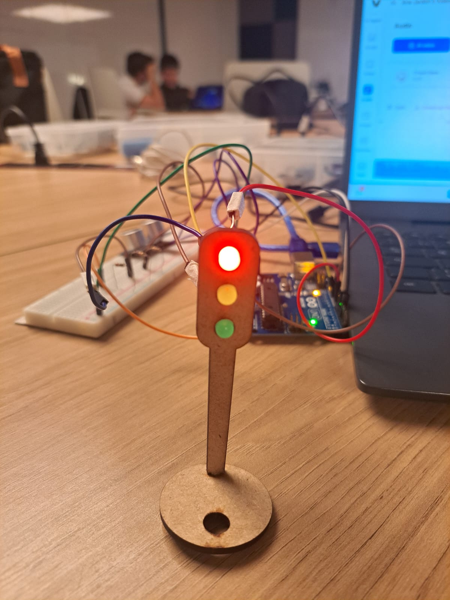
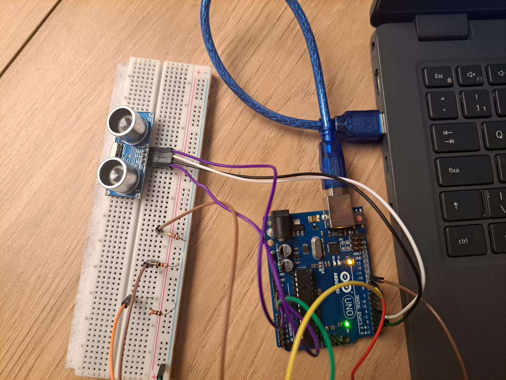

# 🚦 Projeto Semáforo com Sensor Ultrassônico (Arduino)

Este projeto simula o funcionamento de um **semáforo inteligente**, utilizando um **sensor ultrassônico (HC-SR04)** para detectar a aproximação de veículos e iniciar automaticamente o ciclo de luzes (vermelho, amarelo e verde).  
O código foi desenvolvido em **C++ com Programação Orientada a Objetos (POO)** e faz uso de **ponteiros** para gerenciar o sensor e o controle do semáforo.

---

## Componentes Utilizados

| Quantidade | Componente | Descrição |
|-------------|-------------|------------|
| 1 | **Arduino Uno** | Microcontrolador principal do projeto |
| 1 | **Sensor Ultrassônico HC-SR04** | Mede a distância até objetos (usado para detectar carros) |
| 1 | **LED Vermelho** | Representa o sinal de “PARE” |
| 1 | **LED Amarelo** | Representa o sinal de “ATENÇÃO” |
| 1 | **LED Verde** | Representa o sinal de “SIGA” |
| 3 | **Resistores (220 Ω)** | Protegem os LEDs |
| Vários | **Jumpers (macho/macho)** | Fios de conexão |
| 1 | **Protoboard** | Facilita a montagem dos componentes |

---

## Esquema de Ligação

**Sensor HC-SR04**
| Pino | Conexão no Arduino |
|------|--------------------|
| VCC  | 5V |
| GND  | GND |
| TRIG | Pino 3 |
| ECHO | Pino 4 |

**LEDs**
| Cor | Pino no Arduino |
|------|----------------|
| Vermelho | 8 |
| Amarelo | 9 |
| Verde | 10 |

---

## Código do Projeto

```cpp
#include <NewPing.h>

// ======== CONFIGURAÇÕES DE PINOS ========
#define TRIGGER_PIN 3
#define ECHO_PIN 4
#define MAX_DISTANCE 200 // distância máxima (em cm)

const int ledVermelho = 8;
const int ledAmarelo  = 9;
const int ledVerde    = 10;

// ======== CLASSE SEMÁFORO ========
class Semaforo {
  private:
	int vermelho, amarelo, verde;
	NewPing* sonar; // ponteiro para o sensor ultrassônico

  public:
	Semaforo(int pinVermelho, int pinAmarelo, int pinVerde, NewPing* sensor) {
	  vermelho = pinVermelho;
	  amarelo  = pinAmarelo;
	  verde    = pinVerde;
	  sonar    = sensor;

	  pinMode(vermelho, OUTPUT);
	  pinMode(amarelo, OUTPUT);
	  pinMode(verde, OUTPUT);

	  digitalWrite(vermelho, HIGH);
	  digitalWrite(amarelo, LOW);
	  digitalWrite(verde, LOW);
	}

	int medirDistancia() {
	  delay(100);
	  return sonar->ping_cm();
	}

	void executarCiclo() {
	  digitalWrite(vermelho, HIGH);
	  digitalWrite(amarelo, LOW);
	  digitalWrite(verde, LOW);
	  delay(6000);

	  digitalWrite(vermelho, LOW);
	  digitalWrite(amarelo, HIGH);
	  digitalWrite(verde, LOW);
	  delay(2000);

	  digitalWrite(vermelho, LOW);
	  digitalWrite(amarelo, LOW);
	  digitalWrite(verde, HIGH);
	  delay(2000);

	  delay(2000);

	  digitalWrite(vermelho, LOW);
	  digitalWrite(amarelo, HIGH);
	  digitalWrite(verde, LOW);
	  delay(2000);

	  digitalWrite(vermelho, HIGH);
	  digitalWrite(amarelo, LOW);
	  digitalWrite(verde, LOW);
	}
};

// ======== OBJETOS GLOBAIS ========
NewPing sensor(TRIGGER_PIN, ECHO_PIN, MAX_DISTANCE);
Semaforo* semaforo;

void setup() {
  semaforo = new Semaforo(ledVermelho, ledAmarelo, ledVerde, &sensor);
}

void loop() {
  int distancia = semaforo->medirDistancia();

  if (distancia > 0 && distancia < 30) {
	semaforo->executarCiclo();
  }

  delay(100);
}
```

---

## Como Funciona

1. O sensor ultrassônico mede a distância constantemente.  
2. Quando detecta um objeto a menos de **30 cm**, o semáforo inicia o ciclo completo:
   - 🔴 Vermelho — 6 segundos  
   - 🟡 Amarelo — 2 segundos  
   - 🟢 Verde — 2 segundos + 2 segundos extras  
   - 🟡 Amarelo — 2 segundos  
   - E então retorna ao vermelho
3. Caso nada esteja próximo, o semáforo permanece no vermelho.

---

## 🛠️ Como Montar

1. Monte o circuito seguindo o esquema de ligação acima.  
2. Faça o upload do código no **Arduino IDE**.  
3. Instale a biblioteca **NewPing**:  
   - Vá em **Sketch → Incluir Biblioteca → Gerenciar Bibliotecas...**  
   - Procure por **NewPing** e clique em **Instalar**.  
4. Conecte o Arduino à alimentação (USB ou externa).  
5. Aproxime um objeto do sensor para iniciar o ciclo do semáforo.

---

## Imagens do Projeto




---

## 🎥 Demonstração em Vídeo

🔗 [Clique aqui para assistir à demonstração do projeto](https://youtube.com/shorts/XKaNtIyUqfg?feature=share)  
---

## Conceitos Utilizados

- Programação Orientada a Objetos (POO)
- Ponteiros e alocação dinâmica (`new`)
- Uso de sensores ultrassônicos
- Controle de LEDs e tempo (`delay`)
- Integração com biblioteca **NewPing**

---

💡 Desenvolvido como exercício de eletrônica e POO com Arduino.
